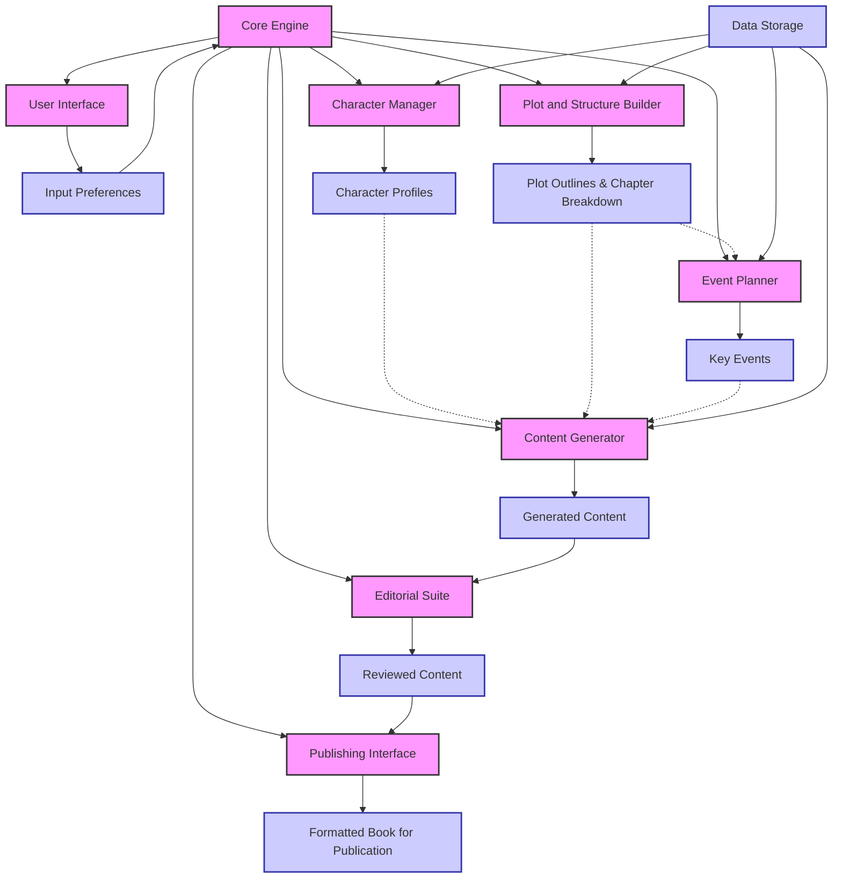

To illustrate the process flow of the high-level design for a book writing system using Langchain, I will create a Mermaid diagram. This diagram will show the interactions between the components and the overall workflow.

### Process Flow Explanation:

1. **User Interface (UI)**: The process starts with the UI (`B`), where the user inputs their preferences for the book, such as genre, subject, and author information (`I`). These preferences are sent to the Core Engine (`A`).

2. **Core Engine**: The Core Engine (`A`) coordinates the entire book creation process. It receives input from the UI and dispatches tasks to the appropriate components.

3. **Character Manager**: The Character Manager (`C`) creates and maintains detailed profiles for main and supporting characters (`J`). These profiles are stored in the Data Storage (`P`) and used by the Content Generator (`E`) to ensure character consistency.

4. **Plot and Structure Builder**: This component (`D`) constructs the plot outline and chapter breakdown (`K`), which are essential for structuring the narrative. This information guides the Event Planner (`F`) and Content Generator (`E`).

5. **Event Planner**: The Event Planner (`F`) designs key events (`M`) that drive the narrative forward, based on the plot structure. These events influence the content generated by the Content Generator.

6. **Content Generator**: With information from the Character Manager, Plot and Structure Builder, and Event Planner, the Content Generator (`E`) produces the narrative content (`L`) for each chapter.

7. **Editorial Suite**: The generated content is then reviewed and refined by the Editorial Suite (`G`), producing a reviewed version of the content (`N`).

8. **Publishing Interface**: Once the content is finalized, the Publishing Interface (`H`) formats the book according to the requirements of different publishing platforms and prepares it for publication (`O`).

9. **Data Storage**: Throughout the process, all data, including character profiles, plot outlines, and generated content, are stored and managed by the Data Storage component (`P`), ensuring that all parts of the system have access to up-to-date information.

This flow ensures that each aspect of the book, from character development to narrative structure and event planning, is cohesively integrated, leading to a well-crafted final product ready for publication.